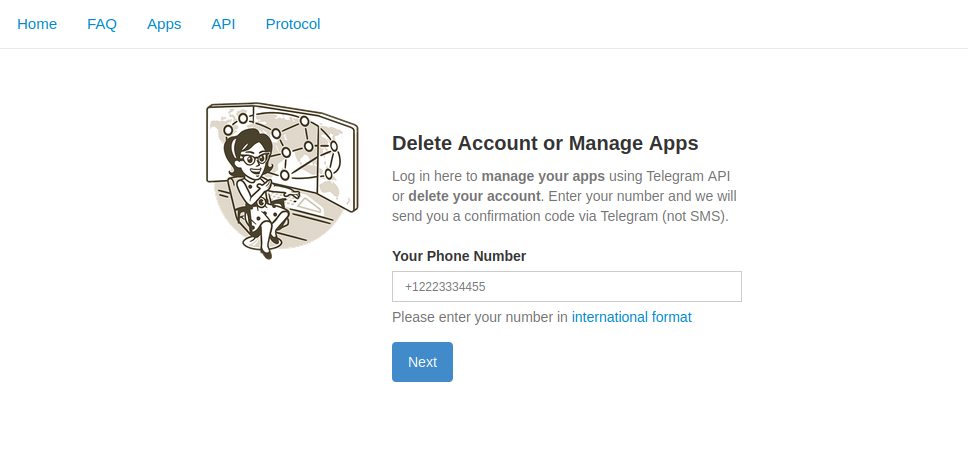
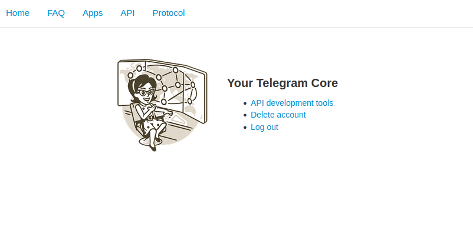
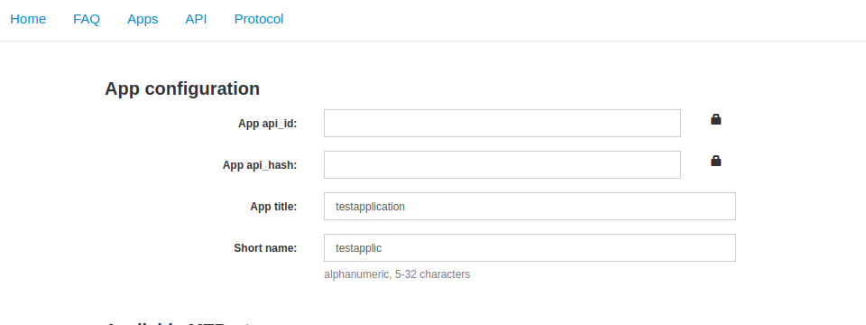
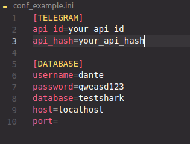

# How to launch the application?
**To start, you need to install the necessary libraries and deploy the database. Also, to work, you need to get tokens to control the bot, we’ll look at this further.
Let's go through all the points, starting with the database** 
## 1. Database setup
---
Need to connect to existing postgres database and create testshark database. **You need to be on the *postgres* user or any other user with sufficient rules.**
```
sudo su postgres
psql postgres
```
Afterwards we create the testshark database.
```SQL
CREATE DATABASE testshark;
```
Afterwards you need to exit postgres and migrate the database. *The database dump is located inside the project (testshark.dump)*
```bash
psql -d testshark -f testshark.dump
```
---
*If your user does not have the appropriate rights, select a different user or use postgres*

```bash
psql -d testshark -f testshark.dump -U your_user
```
---
---
## 2. Libraries setup
Let's create a virtual environment and load libraries.
```bash
python3 -m venv venv
source venv/bin/activate
pip install -r requirements.txt
```
---
---
## 3. Receiving telegram tokens
Log in to your Telegram core: https://my.telegram.org.

Go to "API development tools" and fill out the form.

You need ***api_id*** and ***api_hash***


---
Substitute them into conf_example and ***rename it to conf.ini***



**Also substitute your user into the database config or create a user *dante*, giving him rules over the testshark database in advance.** 
---
---
---
# Launch application
Run the application with the command:
```bash
python3 main.py
```